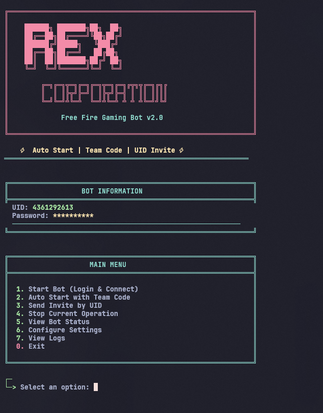

# Free Fire Level Up Bot

A personal automation project built for learning and experimentation with scripting, networking, and protocol handling.  
This project focuses on automating repetitive actions in a controlled environment for educational purposes.

---

## ⚠️ Disclaimer

This project is intended **strictly for educational and personal learning purposes**.

- Not affiliated with Garena or Free Fire
- Not intended for cheating, abuse, or commercial use
- Use at your own risk
- Do not use on accounts you care about

If this violates any platform rules, do **not** run it.

---

## ✨ Features

- Automated login and session handling
- Encrypted packet handling (AES)
- Protobuf-based packet creation & parsing
- Auto-start logic using team codes
- Terminal-based interactive menu
- Modular code structure for experimentation

---

## 🖥️ Preview

> Terminal output example




---

## 🛠️ Requirements

- Python 3.9+
- Internet connection
- Linux / Windows / macOS

### Python dependencies
All dependencies are listed in `requirements.txt`.

---

## 📦 Installation

```bash
git clone https://github.com/<your-username>/Free-Fire-Level-up-bot.git
cd Free-Fire-Level-up-bot
pip install -r requirements.txt
````

---

## ⚙️ Configuration

Create a `.env` file in the root directory:

```env
BOT_UID=your_uid_here
BOT_PASSWORD=your_password_here
```

> Never commit your `.env` file.

---

## ▶️ Usage

Run the main entry point:

```bash
python main.py
```

You will be presented with a terminal menu where you can:

* Start the bot
* Enable auto-start via team code
* Monitor bot status
* View logs
* Stop the current operation

---

## 📂 Project Structure

```text
.
├── main.py                # Terminal UI & controller
├── app.py                 # Core bot logic
├── byte.py                # Protobuf & packet helpers
├── important_zitado.py    # Encryption & decoding helpers
├── jwt_generator_pb2.py   # Generated protobuf
├── MajorLoginRes_pb2.py   # Generated protobuf
├── requirements.txt
images/
└── preview.png
└── README.md
```

---

## 🧠 What This Project Explores

* Network protocol reverse engineering (educational)
* AES encryption & padding
* Protobuf decoding & encoding
* Threaded automation workflows
* Terminal UX design in Python

---

## 🧪 Status

🚧 Experimental / Research Project
Expect breaking changes and unfinished logic.

---

## 📜 License

No license provided.
This project is for **personal study only**.

---
